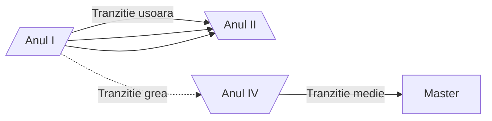
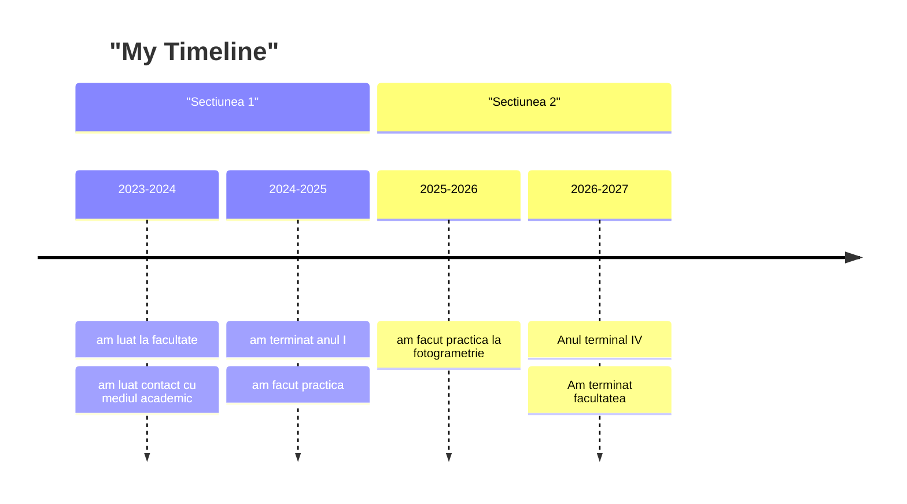

<script id="MathJax-script" async src="https://cdn.jsdelivr.net/npm/mathjax@3/es5/tex-mml-chtml.js"></script>


[HomePage](index.md)

# Diagrame de tip _Flowchart_

```



**De retinut:**
- Driagramele _flowchart_ au _noduri_ si _conectori_
- Nodurile au:
  - **forma** (data de parantezele folosite la deschiderea _nodului_)
  - ID (sirul folofsit in afara descrierii _nodului_)
  - Descrierea (textului ce apare in caseta nodului si care este implementat in interiorul diferitelor tipuri de parateze - ce decit forma casetei nodului)
- Conectorii au:
  - Diferite tipuri de sageti sau chiar pot activa fara segeti
  - Diferite tipuri de linii:
  - `-->` linie continua (sageata dreapta)
  - `--` linie contiuna (fara sageti)
  - `<-->` linie continua (sageata stanga si sageata dreapta)
  - `==>` linie ingrosata cu sageata spre dreapta

## Diagrame _FLowchart_ avansate

```
A & B --> C & D & E --> F & G
```

# Diagrama de tip _TimeLine_


